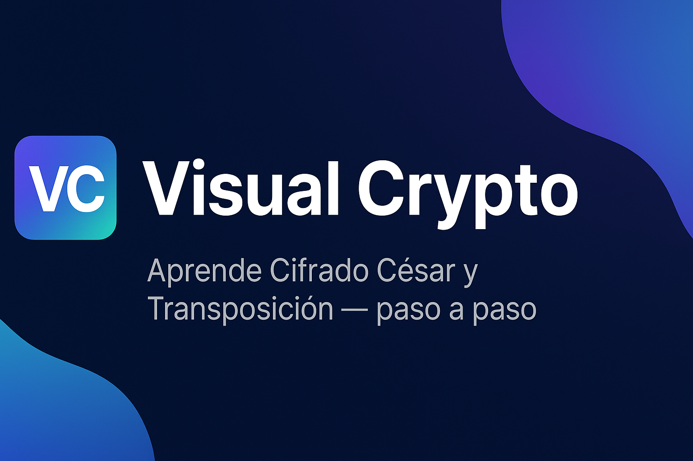

# Visual Crypto  
### _Una experiencia interactiva para aprender cifrado de forma visual, fresca y moderna._



## 🌟 Descripción General

**Visual Crypto** es una aplicación web interactiva que permite **experimentar y visualizar** el proceso de **cifrado César** y **cifrado por Transposición de Columnas**.  
Está pensada con un diseño **moderno, didáctico y visualmente atractivo**, ideal para estudiantes, docentes o entusiastas de la criptografía clásica.

El objetivo es **mostrar paso a paso** cómo funcionan ambos cifrados, permitiendo observar el proceso en tiempo real, modificar parámetros y comprender los principios de **sustitución y difusión**.

## ✨ Características Principales

- 🧩 **Dos técnicas de cifrado**: César (sustitución) y Transposición (difusión).  
- 🎨 **Interfaz moderna** con colores vibrantes, animaciones suaves y diseño responsive.  
- 🔍 **Modo visual paso a paso**, mostrando cómo cada letra o columna cambia durante el cifrado.  
- 🧠 **Modo educativo**, con comentarios y explicaciones integradas en el código.  

## 🧠 Tecnologías Utilizadas

| Tecnología | Descripción |
|-------------|-------------|
| 🧩 **HTML5** | Estructura de la aplicación y componentes visuales. |
| 🎨 **CSS3 / Flex / Grid** | Estilo moderno, responsividad y animaciones. |
| ⚙️ **JavaScript (Vanilla)** | Lógica de cifrado y animaciones interactivas. |
| 🌈 **Font Awesome** | Iconos visuales para botones e interfaz. |

## 🚀 Cómo Ejecutar el Proyecto

1. Clona este repositorio:
   ```bash
   git clone https://github.com/<TU_USUARIO>/visual-crypto.git

2. Entra al proyecto:

   ```bash
   cd visual-crypto
   ```
3. Abre el archivo `index.html` en tu navegador.


## 🧮 Explicación Técnica

### 🔐 Cifrado César

El Cifrado César reemplaza cada letra del mensaje original por otra desplazada un número fijo en el alfabeto.
Ejemplo con desplazamiento de **3**:

```
Texto original:  HOLA
Texto cifrado:   KROD
```

### 🔀 Cifrado por Transposición de Columnas

Este método reorganiza las letras del mensaje en una matriz por filas y las lee por columnas.
Ejemplo con 4 columnas:

```
H O L A
E S T O
E S U N
P R U E
B A X X
↓
Cifrado: HEEPOSLSTRUATOUENAXX
```

## 🧰 Estructura del Proyecto

```
📂 visual-crypto/
│
├── 📜 index.html          # Estructura principal
├── 🎨 styles.css          # Diseño y animaciones
├── ⚙️ script.js           # Lógica de cifrado y animaciones
├── 📄 README.md           # Documentación del proyecto
└── 🖼️ assets/             # Imágenes, íconos y recursos multimedia
```


## 🤝 Colaboradores

Agradecimientos a todas las personas que aportaron al desarrollo del proyecto de criptografía 💚

| Nombre                               | Rol                                | Contacto                                  |
| ------------------------------------ | ---------------------------------- | ----------------------------------------- |
| **Condolo Byron**                    | Diseño de interfaz y usabilidad    | [GitHub](https://github.com/SumonPB)                                        |
| **Lascano Angelo**                   | Documentación técnica              | —                                         |
| **Loya Bryan**                       | Pruebas y control de calidad       | [GitHub](https://github.com/Bryan1093)                                          |
| **Rosero Ruth**                      | Análisis y validación de algoritmos| —                                         |
| **Tapia Freddy**                     | Integración y soporte de código    | [GitHub](https://github.com/XavierT1)                                      |
| **Trujillo Dennis**                  | Desarrollador principal            | [GitHub](https://github.com/Dennis290699) |

¿Quieres colaborar? 🙌
Haz un **fork**, crea una rama y envía un **pull request** con tus mejoras.

> Ejemplo:
>
> ```bash
> git checkout -b mejora-interfaz
> git commit -m "Mejora en diseño responsive"
> git push origin mejora-interfaz
> ```

## 🎉 Gracias por tu Visita

> *“La criptografía no solo protege mensajes… también enseña cómo pensar en seguridad y lógica de una forma bella.”* 💫
> — Proyecto **Visual Crypto**
